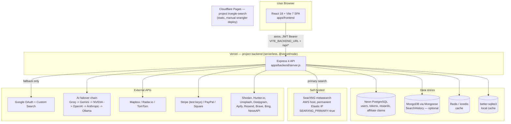
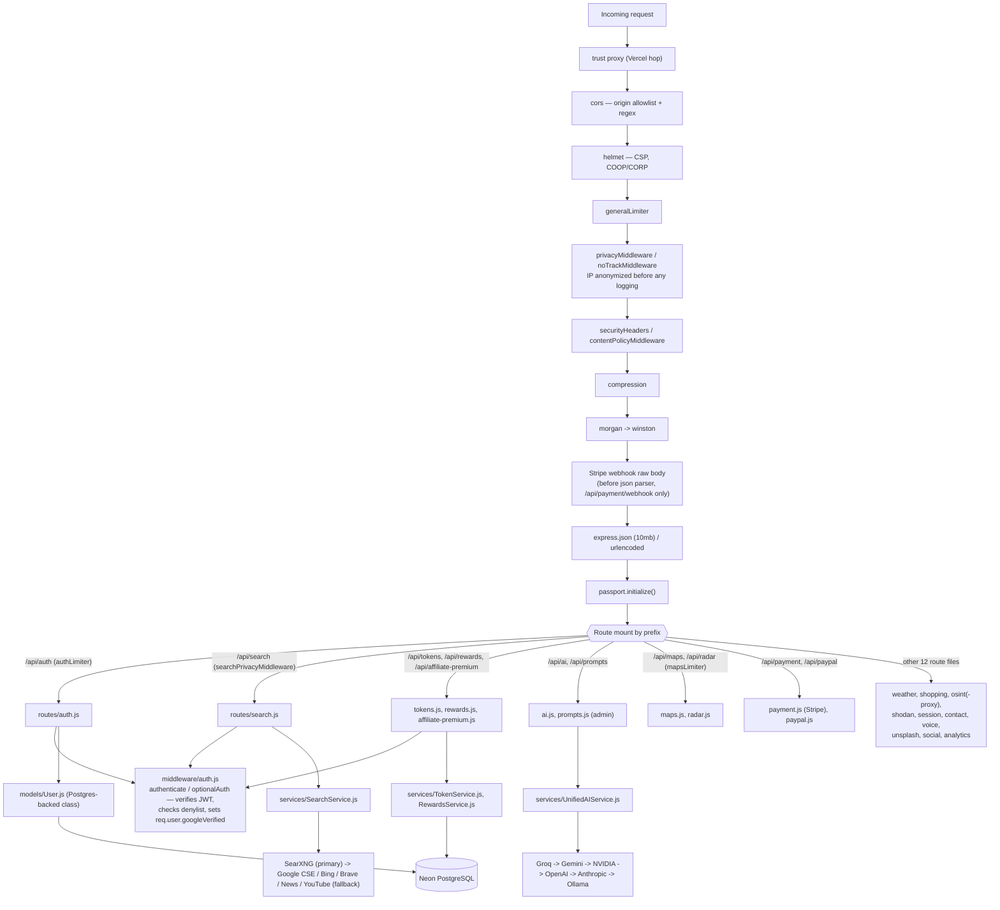
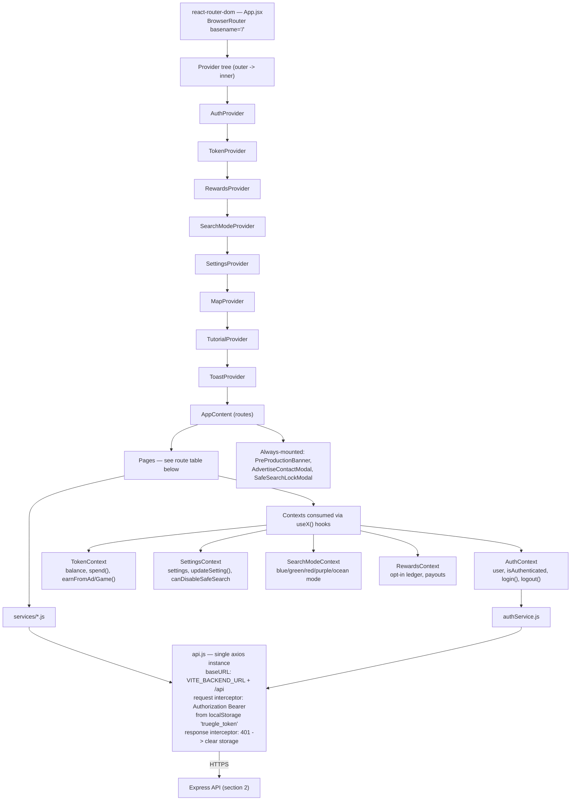
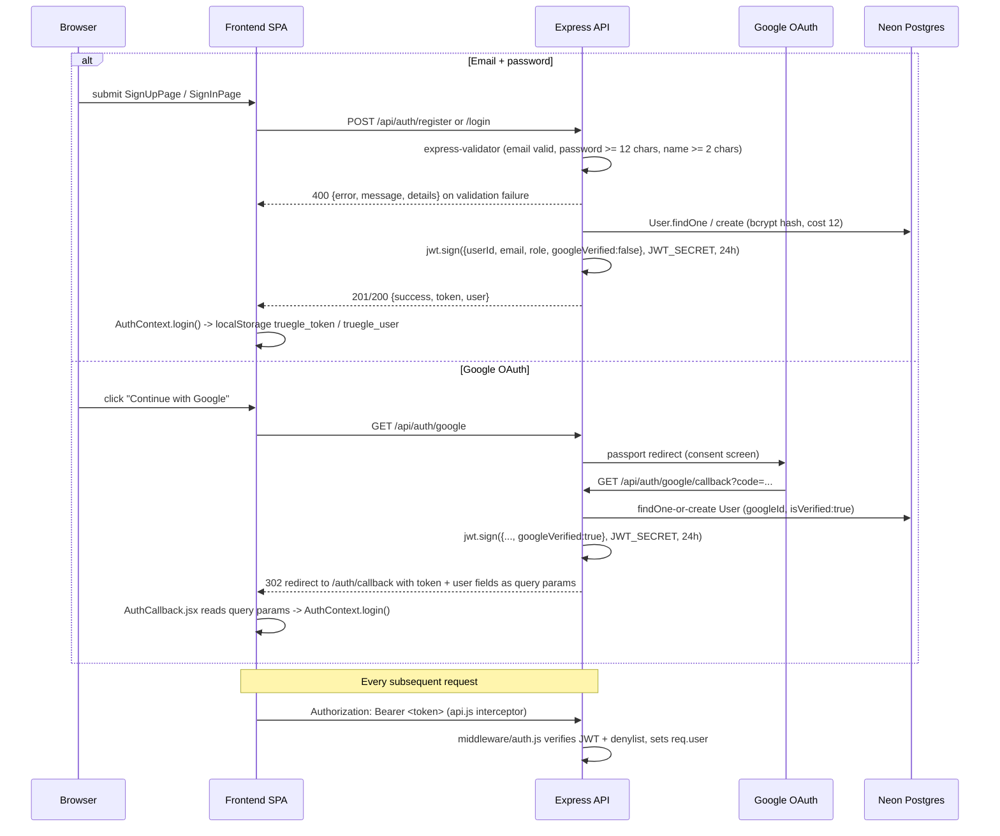
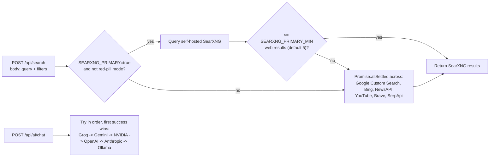

# TruegleSearch — System Architecture

Reference diagram for engineers designing a new feature against the current
codebase + live config. Verified against `main` and `HANDOFF.md` on 2026-06-22.
Code structure (routes/services/contexts) comes from reading the source;
live deployment + feature-flag state comes from `HANDOFF.md` + `config/access.js`
— treat those two as the source of truth over anything older.

---

## 1. Deployment topology

**Live hosts** (`HANDOFF.md` "CURRENT STATE"): `truegle.info` / `www.truegle.info`
+ `truegle-search-15k.pages.dev` (Cloudflare Pages) → frontend.
`backend-seven-khaki-60.vercel.app` → backend. `apps/frontend/vercel.json` and
`apps/backend/vercel.json` both exist, but **the frontend's actual production
home is Cloudflare Pages**, not Vercel — don't assume the Vercel frontend config
is what's live. Cloudflare Pages' GitHub auto-deploy is currently disconnected
(stale `package-lock.json`) so frontend deploys are manual via `wrangler`.

---

## 2. Backend request pipeline

**Middleware order matters here** — note the Stripe webhook gets the raw body
*before* `express.json()` runs (Stripe signature verification needs the raw
bytes), and `optionalAuth`/`authenticate` are applied per-route, not globally.

---

## 3. Backend route map

| Prefix | File | Auth | Notes |
|---|---|---|---|
| `/api/auth` | `auth.js` | none / issues JWT | register, login, validate, logout, Google OAuth (`/google`, `/google/callback`) |
| `/api/search` | `search.js` | `optionalAuth` | SearXNG-primary, Safe-Search-off gated server-side on `req.user.googleVerified` |
| `/api/tokens` | `tokens.js` | mixed | balance, spend, ad/game earning, feature access checks |
| `/api/rewards` | `rewards.js` | mixed | opt-in ad rewards ledger + payout requests |
| `/api/affiliate-premium` | `affiliate-premium.js` | mixed | self-reported affiliate signup bonus claims |
| `/api/ai` | `ai.js` | mixed | chat, content analysis, summary — routes through `UnifiedAIService` |
| `/api/prompts` | `prompts.js` | admin | prompt versioning/rollback, provider config, cache control |
| `/api/maps`, `/api/radar` | `maps.js`, `radar.js` | `mapsLimiter` | geocode, directions, places, traffic cameras |
| `/api/weather` | `weather.js` | none | current + forecast |
| `/api/shopping` | `shopping.js` | none | product search/compare |
| `/api/osint`, `/api/osint-tools` | `osint.js`, `osint-proxy.js` | mixed | email/IP/DNS/whois lookups, phone/username analysis |
| `/api/shodan` | `shodan.js` | mixed | Shodan IP/domain search |
| `/api/payment` | `payment.js` | mixed | Stripe intents/refunds/webhook |
| `/api/paypal` | `paypal.js` | mixed | PayPal payments/subscriptions |
| `/api/session` | `session.js` | mixed | session wipe, privacy info export |
| `/api/contact` | `contact.js` | none | advertiser inquiries |
| `/api/voice` | `voice.js` | mixed | Deepgram transcription, sentiment |
| `/api/unsplash` | `unsplash.js` | none | image search |
| `/api/social` | `social.js` | mixed | social profile search (Apify) |
| `/api/analytics` | `analytics.js` | admin | usage dashboards |

All required env vars are Joi-validated at boot in `config/env.js` — `JWT_SECRET`,
`ENCRYPTION_KEY`, `GOOGLE_API_KEY`, `GOOGLE_SEARCH_ENGINE_ID` are hard-required;
everything else (LLM keys, map keys, payment keys, `SEARXNG_URL`) is optional
and the corresponding service degrades/skips itself when its key is absent.

---

## 4. Frontend architecture

---

## 5. Frontend route map (from `App.jsx`, current)

| Path | Component | Guard |
|---|---|---|
| `/` | `LandingPage` | public |
| `/auth/login`, `/auth/signup`, `/auth/callback` | `SignInPage`, `SignUpPage`, `AuthCallback` | public |
| `/search`, `/green` | `UniversalSearch` (the only live search page; `/green` = locked green mode) | public |
| `/settings`, `/rewards`, `/onboarding` | `SettingsPage`, `RewardsDashboard`, `OnboardingPage` | `ProtectedRoute` — **bypassed entirely while `FREE_ACCESS_MODE` is true** |
| `/feeling-biased`, `/privacy`, `/terms`, `/about`, `/advertise` | static content pages | public |
| `/search-portal`, `/search-results`, `/results`, `/biased`, `/osint*` | `<Navigate>` redirects into `/search` (+ mode query param) | legacy paths kept for old links |
| `*` | `NotFound` | public |

Per `HANDOFF.md`, the following page/component files are **dead code, not
routed anywhere** — don't extend them, they're slated for deletion:
`OSINTMode.jsx`, `SearchResults.jsx`, `SearchPortal*`, `BiasedResults.jsx`,
`ResultsPage.jsx`, `components/SearchResults.jsx`,
`components/ui/SearchResultsContainer.jsx`.

---

## 6. Auth flow

**Current posture (`config/access.js`, frontend-only constants — not env vars):**

| Flag | Value | Effect |
|---|---|---|
| `FREE_ACCESS_MODE` | `true` | `ProtectedRoute`, `TokenGate`, mode-lock checks all short-circuit to "allowed" — login/paywalls are bypassed app-wide |
| `OAUTH_ENABLED` | `true` | Google button shows on Sign In/Up *only if also* `import.meta.env.VITE_SOCIAL_AUTH_ENABLED === 'true'` at build time |
| `PREPRODUCTION_MODE` | `true` | shows the dismissible pre-production banner |

Safe Search "off" is the one place the gate is real and **server-enforced**
regardless of `FREE_ACCESS_MODE`: `routes/search.js` downgrades
`safeSearch: 'off'` to `'safe'` server-side unless `req.user.googleVerified`,
so it can't be bypassed by calling the API directly even with the frontend gate
bypassed.

---

## 7. Search & AI request flow

Google Custom Search is currently 403'ing on quota/project-access per
`HANDOFF.md`; `Promise.allSettled` just drops it and Brave/SearXNG fill in —
don't assume CSE results are present when testing search-result-shape code.

---

## 8. "Where new work plugs in"

**New backend capability:**
1. New file in `routes/`, mount it in `server.js` (pick the right limiter —
   `generalLimiter` is default; `authLimiter`/`mapsLimiter` exist for a reason).
2. Business logic goes in `services/`, not in the route handler.
3. Postgres persistence follows the `models/User.js` pattern (hand-rolled
   class wrapping `db/connection.js`'s `pg.Pool`, not an ORM).
4. Gate with `middleware/auth.js`'s `authenticate` (required) or `optionalAuth`
   (guest-allowed, `req.user` may be undefined) — mirror how `search.js` does it.
5. Any new external API key: add it to the Joi schema in `config/env.js`
   (optional unless the feature is load-bearing) and make the service degrade
   gracefully when absent, same as every existing provider does.

**New frontend capability:**
1. New page in `pages/`, route it in `App.jsx`; wrap in `ProtectedRoute` only
   if it should respect auth once `FREE_ACCESS_MODE` flips back to `false`.
2. New cross-page state → new Context in `context/`, added to the provider
   stack in `App.jsx` (order generally doesn't matter unless one context reads
   another via a hook).
3. All backend calls go through `services/api.js`'s shared axios instance —
   don't hand-roll a fetch with its own base URL; the interceptor already
   handles the JWT header and 401 cleanup.
4. Match existing localStorage keys if touching auth/session state:
   `truegle_token`, `truegle_user`, `truegle_remember_me`,
   `truegle_settings` (settings), `truegle_session_active` (sessionStorage).

---

## 9. Tech stack quick reference

| Layer | Choice |
|---|---|
| Frontend framework | React 18.3 + Vite 7, TypeScript present but app is mostly `.jsx` |
| Frontend routing | react-router-dom 6 |
| Frontend state | Context API only (no Redux/Zustand) |
| Frontend HTTP | Axios, single shared instance |
| Frontend UI | Tailwind CSS, Framer Motion, Lucide icons, shadcn-style `components/ui` |
| Frontend maps/3D | Mapbox GL, Leaflet, Three.js / R3F (landing page visuals) |
| Backend framework | Express 4, CommonJS, Node |
| Backend validation | express-validator (request body), Joi (env config) |
| Backend auth | jsonwebtoken (24h JWT) + Passport Google OAuth2 + bcryptjs |
| Backend DB | PostgreSQL (Neon) via `pg` — primary; Mongoose/MongoDB for `SearchHistory` only; Redis + better-sqlite3 for caching |
| Backend AI | Anthropic SDK, Groq/Gemini/NVIDIA/OpenAI/OpenRouter/Ollama via `UnifiedAIService` failover |
| Backend search | Self-hosted SearXNG (primary) + Google CSE/Bing/Brave/NewsAPI/YouTube (fallback) |
| Backend payments | Stripe (primary, test keys live), PayPal, Square |
| Logging | Winston + Morgan |
| Frontend hosting | Cloudflare Pages (manual `wrangler` deploy) |
| Backend hosting | Vercel serverless (`@vercel/node`) |

---

## 10. Gotchas worth knowing before you design against this

- `services/WeatherService.js` exports a **singleton** — never `new` it.
- `package-lock.json` is out of sync with `package.json` (missing passport +
  related deps) — this is *why* Cloudflare Pages auto-deploy is disconnected.
  Run `npm install` from repo root and commit the lockfile before re-enabling it.
- `.env*` is gitignored everywhere; `apps/frontend/vite.config.js` hardcodes
  the live Vercel backend URL as the prod default so a fresh clone still builds.
- Merges to `main` always need a fresh, explicit go-ahead per batch of commits
  — this is a repo-level human-in-the-loop policy, not a code thing, but it
  affects how fast a change you design here can actually ship.
